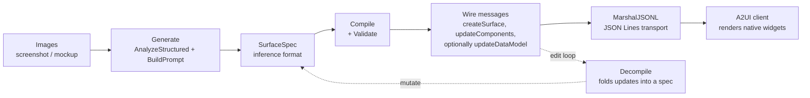

# A2UI Integration (`pkg/vision/a2ui`)

How this SDK speaks [A2UI](https://a2ui.org/) (spec
[v0.9.1](https://a2ui.org/specification/v0_9_1/)): the formats, the lifecycle
from screenshot to rendered surface, the error taxonomy, and the known
real-model quirks the pipeline repairs or rejects.

The package doc (`pkg/vision/a2ui/a2ui.go`) is the API-level entry point; this
file is the conceptual reference.

## Two formats: wire vs inference

The package deliberately keeps two representations. The official wire format is
optimized for clients; the inference format is optimized for LLMs.

|                    | Wire format                                                                | Inference format (`SurfaceSpec`)                                                                                                                        |
| ------------------ | -------------------------------------------------------------------------- | ------------------------------------------------------------------------------------------------------------------------------------------------------- |
| Lives in           | `CreateSurface` / `UpdateComponents` / `UpdateDataModel` / `DeleteSurface` | `SurfaceSpec`                                                                                                                                           |
| Consumers          | A2UI clients (they render it)                                              | the vision model (it produces it) and `Compile`                                                                                                         |
| Component shape    | flat adjacency list, catalog props inlined onto each component             | flat adjacency list, catalog props nested under `properties`                                                                                            |
| Why the difference | mirrors the official JSON schema exactly                                   | `AnalyzeStructured` derives the JSON schema by reflection; custom marshalers are invisible to it, so inlined props would vanish from the derived schema |
| Produced by        | `Compile`, the builders (`NewText`, ...)                                   | the model via `Generate`, or `Decompile` from wire messages                                                                                             |
| Validated by       | `Validate` (structural) + official schema conformance tests                | `Compile` (it validates before returning)                                                                                                               |

This mirrors the official Python SDK's "inference format" concept.

## Lifecycle: image to surface and back

Forward path (`Generate → Compile → MarshalJSONL`): one vision call produces a
whole surface. `GenerateOptions` tunes it: `Task` (what to build), `SurfaceID`,
`CatalogID`, `Theme` (applied when the model emitted none), and `DataModel`
(seed keys; model keys win).

Reverse path (`Decompile`): folds a wire stream back into a `SurfaceSpec` so
surfaces can be diffed, mutated, and recompiled without keeping the original
spec around. `Decompile` accepts the sequence shapes `Compile` emits (single
create, component updates, data-model edits via RFC 6901 pointers) and rejects
anything a fold cannot represent losslessly (pre-create updates, double
create, `deleteSurface`, dynamic child lists, `sendDataModel`) with
`ErrDecompile`.

## Wire message lifecycle and ordering

A surface moves through exactly these states on the wire:

1. `createSurface` — once, first; declares surface id, catalog, and optionally
   theme + data model.
2. `updateComponents` — any number; replaces components by id on the surface.
3. `updateDataModel` — any number; `{"path": "/a/b", "value": x}` writes,
   omitted `value` removes (explicit `null` is a legal write of null).
4. `deleteSurface` — once, last; the surface is gone.

`Validate` enforces the ordering (create-before-update, no double-create, no
use-after-delete) plus structural rules: exactly one `root`, unique non-empty
ids, resolvable child references, and acyclicity (DFS from root). Orphan
components (not reachable from root, but referenced nowhere) are legal per
spec. Validation is structural, not catalog-aware: it cannot tell whether
`variant: "h7"` is a real catalog enum — that class of mistake is caught by
the official-schema conformance tests for builder output, and by the client
for model output.

## Error taxonomy

All errors match `errors.Is`; model-invocation failures additionally carry a
`*vision.ModelError` kind (see [ERROR_DESIGN.md](ERROR_DESIGN.md)).

| Sentinel              | Raised by                               | Meaning                                                                                                                        |
| --------------------- | --------------------------------------- | ------------------------------------------------------------------------------------------------------------------------------ |
| `ErrMalformedMessage` | `UnmarshalMessage`                      | envelope is not exactly one known kind (zero or two kind keys)                                                                 |
| `ErrValidation`       | `Validate`, `Compile`, `Generate`       | aggregate of structural `ValidationIssue`s (wrapped, so typed causes like `ErrComponentCycle` still match through `errors.Is`) |
| `ErrComponentCycle`   | `Validate`                              | component graph has a cycle reachable from root                                                                                |
| `ErrDecompile`        | `Decompile`                             | message stream is not representable as a single `SurfaceSpec`                                                                  |
| `*vision.ModelError`  | `Generate` (wrapped `"a2ui generate:"`) | the vision call itself failed; classified and retryable per kind                                                               |

Policy: `Compile` never returns unvalidated messages — compiled output is
renderable by construction. `Generate` applies the same contract, so a
structurally broken model output surfaces as `ErrValidation`, never as a
half-built surface.

## Real-model quirks

Verified against `llama-server` + a caption-tuned Qwen3-VL fine-tune
(2026-08-18):

- **`"*"`-nested properties (repaired).** The fine-tune emits most components
  as `{"properties": {"*": {"text": ...}}}` — catalog props nested under a
  literal `"*"` key. This is baked into the fine-tune; prompt-side fixes
  (notation legend, concrete example, `(required)` rewording) did not change
  it. `Generate` therefore unwraps a `properties` object that is exactly one
  `"*"` entry before compiling (`unwrapStarProperties`). Mixed shapes (`"*"`
  alongside real props) are left untouched; if they ever appear they fail
  validation loudly instead of being silently mangled.
- **Dangling child references (rejected, not repaired).** Occasionally the
  model references child ids it never defined — observed systematically on
  dense, repetitive screenshots (message lists: N rows shown, N−1 components
  defined, N children referenced). At temperature 0 this is deterministic per
  image, so retrying the same input reproduces it; it fails structural
  validation with the offending component and child id in the message — the
  correct behavior. A different, less repetitive screenshot validates fine.

## Verification

- `conformance_test.go` validates compiled output, one-of-each-kind streams,
  and all 18 builder constructors against the pinned official v0.9.1 schemas
  (`testdata/official/`; refresh procedure in its README). The suite has a
  positive control (the official example message) so it cannot pass vacuously.
- `prompt_pin_test.go` pins `BuildPrompt`'s catalog signatures against the
  pinned catalog — drift fails the build.
- `fuzz_test.go` fuzzes all codec entry points; `bench_test.go` records the
  perf baselines (numbers in `AGENTS.md`).
