# Planning — Post-Todo-List Pareto Execution Plan

**Created:** 2026-07-27 21:18
**Source:** `docs/status/2026-07-27_20-40_full-todo-list-completion.md` (50 next things)
**Author:** Crush planning session
**Status:** **EXECUTED — all E1-E7 complete and verified** (see
`docs/status/2026-07-27_pareto-execution-complete.md`). E2.5 (tag anomaly)
remains blocked on a user decision.

> **Guiding principle: do not verschlimmbessern.** Every task below either
> (a) completes something already shipped, (b) removes a concrete friction
> point, or (c) is deferred to ROADMAP. No new abstractions unless they pay
> for themselves. The structured-hooks redesign, new ErrorKinds without
> demand, and OTel integration are deliberately excluded from the actionable
> waves — they belong in ROADMAP until a concrete need appears.

---

## 1. Pareto Breakdown — Where the Leverage Is

### 1% that delivers 51% of the result

| #     | Item                                                                      | Why it dominates                                                                                                                                                                                                   |
| ----- | ------------------------------------------------------------------------- | ------------------------------------------------------------------------------------------------------------------------------------------------------------------------------------------------------------------ |
| **A** | **Test suite speedup** (`MaxRetries: 1` in test helpers)                  | Drops BDD runtime from 280s → <60s. Biggest DX win in the project. Root cause is fantasy's internal retry layer adding 5s backoff per failing mock call. One helper, ~30min, unblocks every future test iteration. |
| **B** | **Release mechanics** (`nix flake check` + `go mod verify` + tag anomaly) | Without this, the 22 shipped items cannot be tagged `v0.3.0`. Tag anomaly is **blocked on user decision** (destructive).                                                                                           |

**Insight:** A single test-helper change (A) and a single release unblock (B) account for the majority of forward progress. Everything else is polish.

### 4% that delivers 64% of the result

Adds to the above:

| #     | Item                                                                                        | Why it's high-leverage                                                                                                                                            |
| ----- | ------------------------------------------------------------------------------------------- | ----------------------------------------------------------------------------------------------------------------------------------------------------------------- |
| **C** | **Wire `PreprocessConfig.JPEGQuality` into `ResizeImage`**                                  | I shipped a Config field that does nothing. This is a honesty bug — the field exists, callers set it, nothing happens. Must complete or remove the field. ~30min. |
| **D** | **`nix flake check`**                                                                       | The canonical quality gate per AGENTS.md. Never run this session. If it fails, nothing else matters.                                                              |
| **E** | **Docs sync** (README + FEATURES.md reflect Config.Retry, Config.Preprocess, 14 ErrorKinds) | The public surface lies right now. README doesn't mention features added in `[Unreleased]`. ~45min.                                                               |

### 20% that delivers 80% of the result

Adds to the above (the "complete what we started" wave):

| #     | Item                                                                                    | Why it's in the 20%                                                           |
| ----- | --------------------------------------------------------------------------------------- | ----------------------------------------------------------------------------- |
| **F** | **CLI testability refactor** (`parseFlags` accepts `*flag.FlagSet`)                     | Unlocks 5 CLI tests currently impossible. Medium effort but permanent unlock. |
| **G** | **Test coverage for new code** (BMP, Preprocess, CostTracker+Structured, contentFilter) | Coverage of new code is thin. Each test is 5-12min, low risk.                 |
| **H** | **CI hardening** (`go mod tidy`, `config verify`, `nix flake check` job)                | Prevents regression of the very things this session fixed. ~30min.            |

### The other 20% (long tail → ROADMAP, not this plan)

These are deliberately **excluded** from actionable waves and recorded as
ROADMAP candidates. Adding them now = verschlimmbessern:

- New ErrorKinds (529, 402) without a concrete consumer need
- `ModelError.RetryAfter` field — speculative
- Structured hooks `HooksEvent` redesign — breaking change, no demand signal
- `Agent.Close()`, `Conversation.LastMessage()`, `BatchResult.Duration` — speculative API growth
- OpenTelemetry spans — infrastructure, no consumer asking
- Provider failover, result caching, EXIF stripping — all ROADMAP items
- `catwalk` integration — ROADMAP open question
- Streaming auto-retry — design question, deferred

---

## 2. Phase 1 — Comprehensive Plan (30-100min Epics)

All 50 items from the status report are mapped below. **TIER** column shows
Pareto tier (1% / 4% / 20% / TAIL). **Score** = `(Impact × CustomerValue) / Effort`.

| ID     | Epic                                                                              | Tier    | Impact (1-10) | Value (1-10) | Effort (min) | Score       | DO?                           |
| ------ | --------------------------------------------------------------------------------- | ------- | ------------- | ------------ | ------------ | ----------- | ----------------------------- |
| **E1** | Test suite speedup (`MaxRetries:1` helper)                                        | **1%**  | 10            | 9            | 30           | **3.00**    | ✅ NOW                        |
| **E2** | Release mechanics (`nix flake check`, `go mod verify`, annotate `[0.2.0]` lie)    | **1%**  | 9             | 10           | 60           | **1.50**    | ✅ NOW (E2.5 blocked on user) |
| **E3** | Complete `PreprocessConfig` (wire `JPEGQuality`, add `CompressImage`)             | **4%**  | 8             | 7            | 45           | **1.24**    | ✅ NOW                        |
| **E4** | Docs sync (README rewrite, FEATURES.md, `[0.2.0]` annotation)                     | **4%**  | 6             | 8            | 45           | **1.07**    | ✅ NOW                        |
| **E5** | Test coverage for new code (BMP, Preprocess, CostTracker, contentFilter, 501/503) | **20%** | 5             | 6            | 60           | **0.50**    | ✅ NOW                        |
| **E6** | CI hardening (`go mod tidy`, `config verify`, `nix flake check` job)              | **20%** | 4             | 5            | 30           | **0.67**    | ✅ NOW                        |
| **E7** | CLI testability (`parseFlags` FlagSet refactor + flag tests)                      | **20%** | 5             | 4            | 60           | **0.33**    | ✅ NOW                        |
| E8     | Extract `mockModel` → `internal/testmock`                                         | TAIL    | 3             | 3            | 45           | 0.20        | ⏸ LATER                       |
| E9     | Tag anomaly resolution                                                            | TAIL    | 8             | 7            | 30           | **BLOCKED** | ⏸ USER                        |
| E10    | Streaming retry-exclusion test                                                    | TAIL    | 3             | 4            | 20           | 0.60        | ⏸ LATER                       |
| E11    | New ErrorKinds (529, 402)                                                         | TAIL    | 2             | 2            | 30           | 0.13        | ⏸ ROADMAP                     |
| E12    | `ModelError.RetryAfter` field                                                     | TAIL    | 2             | 2            | 45           | 0.09        | ⏸ ROADMAP                     |
| E13    | Structured hooks `HooksEvent` redesign                                            | TAIL    | 4             | 2            | 120          | 0.07        | ⏸ ROADMAP (breaking)          |
| E14    | `Analyzer` interface expansion                                                    | TAIL    | 3             | 2            | 60           | 0.10        | ⏸ ROADMAP (breaking)          |
| E15    | Remove `VisionAgent` alias                                                        | TAIL    | 2             | 2            | 20           | 0.20        | ⏸ ROADMAP (breaking)          |
| E16    | `Agent.Close()`                                                                   | TAIL    | 2             | 2            | 30           | 0.13        | ⏸ ROADMAP                     |
| E17    | `Conversation.LastMessage()`                                                      | TAIL    | 2             | 2            | 15           | 0.27        | ⏸ ROADMAP                     |
| E18    | `BatchResult.Duration`                                                            | TAIL    | 2             | 2            | 20           | 0.20        | ⏸ ROADMAP                     |
| E19    | `catwalk` integration                                                             | TAIL    | 5             | 3            | 180          | 0.08        | ⏸ ROADMAP                     |
| E20    | Provider failover                                                                 | TAIL    | 4             | 3            | 240          | 0.05        | ⏸ ROADMAP                     |
| E21    | Result caching                                                                    | TAIL    | 4             | 3            | 180          | 0.07        | ⏸ ROADMAP                     |
| E22    | OpenTelemetry spans                                                               | TAIL    | 3             | 2            | 180          | 0.03        | ⏸ ROADMAP                     |
| E23    | `Hooks.OnBatchStart/Finish`                                                       | TAIL    | 3             | 2            | 45           | 0.13        | ⏸ ROADMAP                     |
| E24    | `Agent.Cost()` method                                                             | TAIL    | 2             | 2            | 20           | 0.20        | ⏸ ROADMAP                     |
| E25    | Structured logging hook example                                                   | TAIL    | 2             | 2            | 30           | 0.13        | ⏸ ROADMAP                     |
| E26    | API reference generation in CI                                                    | TAIL    | 3             | 2            | 60           | 0.10        | ⏸ ROADMAP                     |
| E27    | EXIF stripping                                                                    | TAIL    | 2             | 2            | 60           | 0.07        | ⏸ ROADMAP                     |
| E28    | Error-handling docs page                                                          | TAIL    | 3             | 3            | 45           | 0.20        | ⏸ LATER                       |
| E29    | Fuzz tests for `Classify`                                                         | TAIL    | 3             | 2            | 45           | 0.13        | ⏸ LATER                       |
| E30    | `WithRetry` jitter determinism test                                               | TAIL    | 2             | 2            | 20           | 0.20        | ⏸ LATER                       |

**Totals (actionable NOW, E1-E7):** 330 min (~5.5h) of focused work delivers ~80% of remaining value.

---

## 3. Phase 2 — Subtask Breakdown (max 12min each)

Every actionable Epic (E1-E7) is broken into ≤12min subtasks. **Order within
each epic is the execution order.** Cross-epic order follows the Score column
above (E1 → E2 → E3 → E4 → E5 → E6 → E7).

### E1 — Test Suite Speedup (4 subtasks, ~30min)

| ID   | Subtask                                                                                                                                          | Est   | Why                                    |
| ---- | ------------------------------------------------------------------------------------------------------------------------------------------------ | ----- | -------------------------------------- |
| E1.1 | Add `testAgentConfig()` helper in `mock_test.go` returning a `Config` with `MaxRetries: 1` and the given model                                   | 5min  | Centralizes the fix; one place to tune |
| E1.2 | Update `newTestAgent`, `setupAgent`, `setupAgentWithModel` to use the helper                                                                     | 8min  | All test agents get the speedup        |
| E1.3 | Run `go test -v ./pkg/vision/ 2>&1 \| ts` and confirm runtime <60s                                                                               | 5min  | Verify the win                         |
| E1.4 | Tighten retry-count assertions in `TestConfigRetryRetriesTransientAnalyze` etc. from `GreaterOrEqual` to exact now that counts are deterministic | 10min | Makes tests more precise               |

### E2 — Release Mechanics (5 subtasks, ~60min; E2.5 blocked)

| ID   | Subtask                                                                                                | Est   | Why                               |
| ---- | ------------------------------------------------------------------------------------------------------ | ----- | --------------------------------- |
| E2.1 | Run `nix flake check 2>&1` and capture output                                                          | 10min | Canonical quality gate            |
| E2.2 | Fix anything `nix flake check` flags (likely `vendorHash`)                                             | 20min | Blocking if stale                 |
| E2.3 | Run `go mod verify && go mod tidy && git diff go.mod go.sum`                                           | 5min  | Dependency integrity              |
| E2.4 | Annotate `[0.2.0]` CHANGELOG license line with retroactive note (non-destructive)                      | 5min  | Honesty about the historical lie  |
| E2.5 | **BLOCKED:** tag anomaly proposal — write a one-paragraph recommendation into ROADMAP "Open questions" | 10min | Needs user decision (destructive) |

### E3 — Complete PreprocessConfig (5 subtasks, ~45min)

| ID   | Subtask                                                                                            | Est   | Why                               |
| ---- | -------------------------------------------------------------------------------------------------- | ----- | --------------------------------- |
| E3.1 | Add `quality int` param to internal resize path OR read from `PreprocessConfig` in `preprocessAll` | 8min  | Wire the existing field           |
| E3.2 | Update `ResizeImage` to accept a quality option (keep default 85, add `ResizeImageWithQuality`)    | 10min | Public API for compression        |
| E3.3 | Add `CompressImage(img, quality)` that re-encodes JPEG without resize                              | 10min | New capability (compression-only) |
| E3.4 | Add test: `PreprocessConfig{JPEGQuality: 50}` produces smaller bytes than default                  | 8min  | Verify wiring                     |
| E3.5 | Add test: `CompressImage` reduces size, preserves PNG when source is PNG                           | 10min | Verify new function               |

### E4 — Docs Sync (4 subtasks, ~45min)

| ID   | Subtask                                                                                                             | Est   | Why                           |
| ---- | ------------------------------------------------------------------------------------------------------------------- | ----- | ----------------------------- |
| E4.1 | Rewrite README.md: add Config.Retry, Config.Preprocess, `NewAgentWithCostTracker`, 14 ErrorKinds, `PreprocessImage` | 20min | Public surface currently lies |
| E4.2 | Update FEATURES.md with new feature inventory (DONE/PARTIALLY DONE/PLANNED)                                         | 15min | Project doc discipline        |
| E4.3 | Verify README code blocks compile (`go vet` on snippets if feasible)                                                | 5min  | Don't ship broken examples    |
| E4.4 | Cross-link `docs/DOMAIN_LANGUAGE.md` from README                                                                    | 5min  | Discoverability               |

### E5 — Test Coverage for New Code (8 subtasks, ~60min)

| ID   | Subtask                                                                                           | Est   | Why                                   |
| ---- | ------------------------------------------------------------------------------------------------- | ----- | ------------------------------------- |
| E5.1 | `mediaTypeFromExtension` table test: `.png`, `.jpg`, `.jpeg`, `.gif`, `.webp`, `.bmp`, `.unknown` | 8min  | New code untested                     |
| E5.2 | BMP decode → resize roundtrip test in `preprocess_test.go` (needs a tiny BMP fixture)             | 12min | BMP decoder registered but untested   |
| E5.3 | `PreprocessImage` nil-config + zero-MaxDimension passthrough test                                 | 5min  | New function                          |
| E5.4 | `Config.Preprocess` auto-application in `AnalyzeStructured` test                                  | 10min | New wiring                            |
| E5.5 | `NewAgentWithCostTracker` + `AnalyzeStructured` nil-RawResponse test                              | 8min  | Verifies the documented contract      |
| E5.6 | `contentFilterSignals` detection test (various provider messages, positive + negative)            | 8min  | New classification logic              |
| E5.7 | 501 → `KindNotImplemented` and 503 → `KindServiceUnavailable` via full `Analyze` path             | 5min  | Currently only tested in `pkg/errors` |
| E5.8 | `AnalyzeBatch` mixed success + error (success path currently untested)                            | 10min | Coverage gap                          |

### E6 — CI Hardening (3 subtasks, ~30min)

| ID   | Subtask                                                               | Est   | Why                         |
| ---- | --------------------------------------------------------------------- | ----- | --------------------------- |
| E6.1 | Add `go mod tidy --diff` check step to `ci.yml`                       | 5min  | Prevents dirty go.mod       |
| E6.2 | Add `golangci-lint config verify` step to lint job                    | 5min  | Prevents broken lint config |
| E6.3 | Add `nix flake check` job (separate, runs on Ubuntu with Nix install) | 20min | Canonical gate in CI        |

### E7 — CLI Testability (5 subtasks, ~60min)

| ID   | Subtask                                                                                                                            | Est   | Why                                |
| ---- | ---------------------------------------------------------------------------------------------------------------------------------- | ----- | ---------------------------------- |
| E7.1 | Refactor `parseFlags()` → `parseFlags(fs *flag.FlagSet, args []string) (*config, error)`                                           | 15min | Removes `os.Exit`, enables testing |
| E7.2 | Update `main()` to call `parseFlags(flag.CommandLine, os.Args[1:])`                                                                | 5min  | Preserve behavior                  |
| E7.3 | Add tests: each flag parses correctly (provider, model, prompt, system, stream, temperature, maxTokens, json, structured, timeout) | 12min | Coverage                           |
| E7.4 | Add test: `-version` flag prints version and exits 0                                                                               | 5min  | Untested branch                    |
| E7.5 | Add test: no positional args → usage + exit 1                                                                                      | 5min  | Untested branch                    |

**Phase 2 grand total (E1-E7):** 34 subtasks, ~330min, all ≤12min each.

---

## 4. Execution Graph (Mermaid)

```mermaid
flowchart TD
    START([Session Start]) --> E1[E1: Test Speedup<br/>30min, Score 3.00]

    E1 --> E1a[E1.1: testAgentConfig helper]
    E1a --> E1b[E1.2: Update test agents]
    E1b --> E1c[E1.3: Verify runtime <60s]
    E1c --> E1d[E1.4: Tighten count assertions]
    E1d --> E2{E2: Release Mechanics<br/>60min, Score 1.50}

    E2 --> E2a[E2.1: nix flake check]
    E2a --> E2b{Pass?}
    E2b -- No --> E2fix[E2.2: Fix flake issues]
    E2fix --> E2c
    E2b -- Yes --> E2c[E2.3: go mod verify + tidy]
    E2c --> E2d[E2.4: Annotate 0.2.0 CHANGELOG]
    E2d --> E2e[E2.5: Tag anomaly proposal<br/>BLOCKED ON USER]
    E2e -.->|blocked| USER[(User Decision<br/>Required)]

    E2d --> E3[E3: Complete PreprocessConfig<br/>45min, Score 1.24]
    E3 --> E3a[E3.1: Wire JPEGQuality]
    E3a --> E3b[E3.2: ResizeImageWithQuality]
    E3b --> E3c[E3.3: CompressImage function]
    E3c --> E3d[E3.4: Test JPEGQuality wiring]
    E3d --> E3e[E3.5: Test CompressImage]
    E3e --> E4

    E4[E4: Docs Sync<br/>45min, Score 1.07] --> E4a[E4.1: Rewrite README]
    E4a --> E4b[E4.2: Update FEATURES.md]
    E4b --> E4c[E4.3: Verify snippets compile]
    E4c --> E4d[E4.4: Cross-link DOMAIN_LANGUAGE]
    E4d --> E5

    E5[E5: Test Coverage<br/>60min, Score 0.50] --> E5a[E5.1: mediaType table]
    E5a --> E5b[E5.2: BMP resize roundtrip]
    E5b --> E5c[E5.3: PreprocessImage nil]
    E5c --> E5d[E5.4: Preprocess in Structured]
    E5d --> E5e[E5.5: CostTracker nil RawResponse]
    E5e --> E5f[E5.6: contentFilter signals]
    E5f --> E5g[E5.7: 501/503 via Analyze]
    E5g --> E5h[E5.8: Batch mixed success]
    E5h --> E6

    E6[E6: CI Hardening<br/>30min, Score 0.67] --> E6a[E6.1: go mod tidy check]
    E6a --> E6b[E6.2: config verify step]
    E6b --> E6c[E6.3: nix flake check job]
    E6c --> E7

    E7[E7: CLI Testability<br/>60min, Score 0.33] --> E7a[E7.1: parseFlags FlagSet refactor]
    E7a --> E7b[E7.2: Update main]
    E7b --> E7c[E7.3: Flag parse tests]
    E7c --> E7d[E7.4: -version test]
    E7d --> E7e[E7.5: Missing args test]
    E7e --> DONE([All Actionable Work Done])

    DONE -.-> ROADMAP[ROADMAP backlog:<br/>28 items, deferred]

    classDef now fill:#90EE90,stroke:#333,stroke-width:2px;
    classDef blocked fill:#FFD700,stroke:#333,stroke-width:2px;
    classDef roadmap fill:#ADD8E6,stroke:#333,stroke-width:1px;
    class E1,E2,E3,E4,E5,E6,E7 now;
    class E2e,USER blocked;
    class ROADMAP roadmap;
```



---

## 5. Risk Analysis — What NOT to Verschlimmbessern

| Risk                                                     | Why it's tempting                     | Why it's wrong                                                                                                                             | Decision                                                    |
| -------------------------------------------------------- | ------------------------------------- | ------------------------------------------------------------------------------------------------------------------------------------------ | ----------------------------------------------------------- |
| Redesign `Hooks` into `HooksEvent` struct                | The nil-`RawResponse` hack feels ugly | It's documented, tested, and works. A redesign is a breaking change with zero demand signal.                                               | **Keep doc-only fix. Defer to ROADMAP.**                    |
| Add `KindOverloaded` (529) + `KindPaymentRequired` (402) | "More error kinds = more precise"     | No consumer is asking. Each kind adds a classification branch, a test case, a CLI advice string, a DOMAIN_LANGUAGE entry. Pure complexity. | **Defer to ROADMAP until a real provider error forces it.** |
| Make `Config.Retry` retry streaming methods              | "Consistency"                         | Partial-stream + retry has ambiguous delta semantics. The current doc says "wrap manually." Auto-retry would surprise users.               | **Keep current behavior. Document loudly.**                 |
| Extract `mockModel` into `internal/testmock`             | "Shared code is DRY"                  | Only `pkg/vision` uses it. A shared package couples unrelated tests and adds an import cycle risk.                                         | **Defer until a second package actually needs it.**         |
| Add `Agent.Close()`                                      | "Resource cleanup is good practice"   | The agent holds no long-lived connections (fantasy manages HTTP). `Close` would be a no-op confusing the API.                              | **Defer to ROADMAP.**                                       |
| Auto-wire `catwalk` for CLI providers                    | "Reduces rot"                         | It's a 180min migration with unclear catwalk maturity. The current providers work and are build-verified.                                  | **Defer to ROADMAP open question.**                         |

---

## 6. Long-Tail Items (ROADMAP — Not Actionable Now)

Recorded for completeness. All 28 items from the status report's "50 next
things" that are NOT in E1-E7 belong here. They will be reviewed monthly and
promoted to TODO_LIST only when they become bounded and actionable.

Categories: Error Handling (E11, E12, E32, E33), Architecture (E13-E18, E20-E22),
Observability (E22-E25), Docs (E26, E28), Testing Polish (E8, E10, E29, E30).

---

## 7. Execution Order Summary

```
1. E1 (test speedup) → unblock fast iteration
2. E2.1-E2.4 (release mechanics, minus blocked tag item)
3. E3 (complete PreprocessConfig — honesty fix)
4. E4 (docs sync — make public surface honest)
5. E5 (test coverage — lock in new code)
6. E6 (CI hardening — prevent regression)
7. E7 (CLI testability — permanent unlock)
```

**Stop condition:** All E1-E7 subtasks pass `go test -race ./...` + `golangci-lint run ./...` + `nix flake check`. Then commit, tag candidate `v0.3.0` (pending tag anomaly decision), and wait for user.

---

## 8. Open Questions for User (carried from status report)

1. **Tag anomaly** — delete + re-tag `v0.3.0`, or supersede with `v0.4.0`?
2. **Breaking `Hooks` change in v0.3.0?** (structured hooks redesign)
3. **Streaming auto-retry?** (currently excluded by design)

These do NOT block E1-E7 execution.
