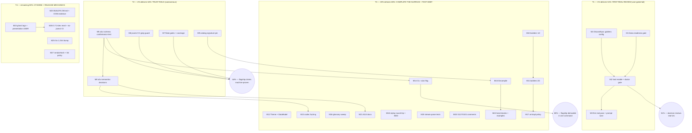

# Pareto Execution Plan — A2UI Trust, Real Activation, and v0.7 Cycle Hygiene

**Date:** 2026-08-18 13:42
**Scope:** All 34 open items from `TODO_LIST.md` (2026-08-18 harvest of the
08-17/08-18 sessions), ranked by Pareto impact and split into executable
slices. Inputs: `TODO_LIST.md`, `ROADMAP.md`, `docs/status/2026-08-17_*`,
`docs/status/2026-08-18_*`.

**Ground truth at plan time:**
v0.6.1 released, CI green since `1bc1523`, pkg.go.dev serves v0.6.1,
SystemNix lock pins `dcd50a0` (committed), working tree clean at `38b33e7`.
The daemon is fully built but has never reviewed a real screenshot; the a2ui
package is green on tests but its headline claims were reworded (not yet
machine-proven); the go-auto-upgrade daemon keeps trying a json/v2 migration
that can never compile here.

---

## Step 1 — Pareto Breakdown

### The 20% that deliver 80%

1. **visionreviewd first REAL review** — host enable + doctor gate + one
   real `once` + DiscordSync goldens wired. Converts the project from
   "verified against fakes" to "actually reviewing UIs" — the product's
   entire reason to exist.
2. **A2UI trust trio** — official-schema conformance test, catalogSignature
   pin, semantics decisions. Makes the newest, most differentiated feature
   provably correct instead of plausibly correct.
3. **json/v2 CI grep guard** — one cheap test stops the recurring
   break/restore flapping (4 documented incidents) from ever reaching
   `main` again.
4. **Flake gates + coverage** — `nix run .#test`/`.#lint` parity closes the
   "system lint ≠ pinned lint" blind spot that hid a CI-only failure for days.

### The 4% that deliver 64%

The activation chain **plus** the a2ui conformance test and the json/v2
guard: after these, every remaining task is polish on things that already
work and are already proven.

### The 1% that deliver 51%

**One host, one real model, one real pass over DiscordSync goldens.**
Everything the project has built — SDK, daemon, event sourcing, replay,
NixOS module, SystemNix wiring — funnels into that single moment. It is
user-gated (host access, ~9–10 GB model pull, model-intent confirmation)
but every repo-side enabler is preparable autonomously (llama readiness
gate, config, discover).

### The other 80% (last 20% of value — do not skip)

API completion (10 builders, Theme/DataModel, Decompile), test debt
(fuzz, round-trips, BDD), documentation debt (glossary, A2UI.md,
DUPLICATION_POLICY), and release hygiene (ghost tags, Go 1.26.6, version
reset, no-jsonv2 CI job, vendorHash.nix, lint-noise policy). None of it
blocks the 51% — all of it is required for 100%.

---

## Step 2 — Comprehensive Plan (medium granularity, 10–30 min per task)

Sorted by tier (impact), then impact/effort ratio. `USER` = user-gated.

| ID  | Task                                                                                  | Tier | Impact   | Effort   | Customer value                                          | Depends |
| --- | ------------------------------------------------------------------------------------- | ---- | -------- | -------- | ------------------------------------------------------- | ------- |
| M1  | llama readiness gate: `ExecStartPost` `/health` probe in llama unit                   | T1   | High     | 20m      | First pass no longer races the ~10 GB model load        | —       |
| M2  | Host enable: config from example + discover, enable module, `doctor`                  | T1   | Critical | 30m USER | The daemon exists somewhere real                        | M1, M4  |
| M3  | First real `visionreviewd once` + eyeball review/INDEX + prompt tune                  | T1   | Critical | 30m USER | The 51% moment; validates caption-tuned prompts         | M2      |
| M4  | DiscordSync goldens → config via `discover` + scan-count validation                   | T1   | High     | 15m      | First real watched project                              | —       |
| M5  | A2UI official-schema conformance test (`kaptinlin/jsonschema`)                        | T2   | Critical | 30m      | Newest headline feature becomes machine-proven          | —       |
| M6  | json/v2 CI grep guard (ONE mechanism: CI step) + external-fix note                    | T2   | High     | 15m      | Stops the 4×-documented breakage class at the gate      | —       |
| M7  | Flake gates: `nix run .#test`, `nix run .#lint`, record a2ui coverage                 | T2   | High     | 25m      | Kills the system-vs-pinned linter blind spot            | —       |
| M8  | A2UI decisions bundle: `"value": null`, unknown keys, exhaustruct scope + AGENTS note | T2   | High     | 30m      | Wire-format semantics documented and deliberate         | M5      |
| M9  | Pin `catalogSignatures` (19 kinds) + `SchemaName` BDD assert                          | T2   | Medium   | 15m      | Catalog drift becomes loud instead of silent            | —       |
| M10 | Builders 1/2: CheckBox, ChoicePicker, DateTimeInput, Slider, Tabs                     | T3   | Medium   | 30m      | Ergonomic API for half the missing catalog kinds        | —       |
| M11 | Builders 2/2: TextField, List, Modal, AudioPlayer, Video + doc table                  | T3   | Medium   | 30m      | Full builder coverage; users see what's typed vs manual | M10     |
| M12 | `GenerateOptions.Theme` passthrough + `DataModel` seed merge + tests                  | T3   | Medium   | 25m      | Surfaces stop being one flat default                    | —       |
| M13 | Fuzz codecs: `UnmarshalMessage`, `UnmarshalJSONL`, `Component`, `ChildList`           | T3   | Medium   | 30m      | Decoder robustness against hostile/malformed input      | M8      |
| M14 | CLI `cmd/vision -a2ui mockup.png` → JSONL on stdout                                   | T3   | High     | 25m      | 10-second demo of the flagship feature                  | M5      |
| M15 | `Decompile(messages) → SurfaceSpec` + round-trip test                                 | T3   | Medium   | 30m      | Edit round-trips/diffing; closes Compile asymmetry      | M9      |
| M16 | DOMAIN_LANGUAGE glossary sweep: visionreviewd + a2ui vocab                            | T3   | Medium   | 25m      | Glossary stops being two bounded contexts behind        | —       |
| M17 | art-dupl over a2ui + DUPLICATION_POLICY judgment calls                                | T3   | Low      | 20m      | Duplication policy covers the newest package            | M10/M11 |
| M18 | `CompareManually`→wipe→`Replay` round-trip test + replay BDD spec                     | T3   | Medium   | 30m      | Replay correctness proven beyond pipeline path          | —       |
| M19 | `consumeObjectStream` partial-malformed test + structured-stream example review       | T3   | Medium   | 20m      | Streaming-parse tolerance contract is tested            | —       |
| M20 | `.golangci.yaml` G117/G101 rationale comments                                         | T3   | Low      | 10m      | Config stops being archaeology                          | —       |
| M21 | `docs/A2UI.md` (formats, lifecycle, errors) + package README                          | T3   | Medium   | 30m      | pkg.go.dev browsers get a landing pad                   | M8      |
| M22 | Benchmarks (`MarshalJSONL`/`Validate`/`UnmarshalMessage`) + `Example_*`               | T3   | Low      | 30m      | Perf baselines + tested godoc                           | M15     |
| M23 | `docs/BUILDFLOW.md` + OOM kernel-log evidence                                         | T4   | Low      | 20m      | Future sessions stop re-triaging known flapping         | —       |
| M24 | Ghost tag deletion + release presentation (promote v0.6.1 / v0.6.2?)                  | T4   | Low      | 15m USER | Clean version list; Latest badge tells the truth        | —       |
| M25 | Go 1.26.6 probe; bump go.mod + flake if nixpkgs ships it                              | T4   | Medium   | 15m      | Clears 5 stdlib govulncheck findings                    | —       |
| M26 | `version` → `0.7.0-dev` reset + CI job building SDK WITHOUT jsonv2                    | T4   | Medium   | 20m      | Next cycle opens correctly; consumer guarantee locked   | M24     |
| M27 | `vendorHash.nix` extraction + lint-noise policy decision                              | T4   | Low      | 20m      | Cleaner dep bumps; ambient warning noise gets a verdict | —       |

**27 medium tasks. 100% TODO coverage:** all 34 TODO_LIST items map to
M-IDs (M8 absorbs three decision items; M10/M11 split the 10 builders;
M18/M19/M23/M24/M26/M27 each absorb pairs).

---

## Step 3 — Detailed Breakdown (fine granularity, ≤12 min per task)

Sorted by tier, then execution order inside the tier.

| ID  | Task (≤12 min each)                                                      | Parent | Impact   | Est | Depends |
| --- | ------------------------------------------------------------------------ | ------ | -------- | --- | ------- |
| F1  | Add `ExecStartPost` curl `/health` probe to the llama unit               | M1     | High     | 10m | —       |
| F2  | Module eval check (enabled variant) + `nix flake check` green            | M1     | High     | 8m  | F1      |
| F3  | Write `/etc/visionreviewd/config.json` from example + `discover` output  | M2     | Critical | 12m | F2, F10 |
| F4  | Enable `services.vision-review-agent` (+ optional llama) in host config  | M2     | Critical | 12m | F3      |
| F5  | Run `visionreviewd doctor` as activation gate; fix any FAILs             | M2     | Critical | 6m  | F4      |
| F6  | Run `visionreviewd once` against the real model                          | M3     | Critical | 10m | F5      |
| F7  | Eyeball one review markdown + INDEX; note prompt weaknesses              | M3     | Critical | 12m | F6      |
| F8  | Tune review/compare prompts (descriptive→critical) round 1               | M3     | Critical | 12m | F7      |
| F9  | Re-run pass; diff review quality before/after tuning                     | M3     | High     | 10m | F8      |
| F10 | Run `discover` over DiscordSync goldens; fold globs into config          | M4     | High     | 10m | —       |
| F11 | Validate scan counts via doctor (non-zero matches, no orphans)           | M4     | High     | 6m  | F10     |
| F12 | Add `kaptinlin/jsonschema` dep; fetch + pin official v0.9.1 schemas      | M5     | Critical | 12m | —       |
| F13 | Conformance test happy path: spec → Compile → JSONL → validate           | M5     | Critical | 12m | F12     |
| F14 | Conformance failure paths: malformed envelope, bad kind, bad prop        | M5     | High     | 12m | F13     |
| F15 | Wire into `go test ./...`; run full suite green                          | M5     | High     | 8m  | F14     |
| F16 | Add CI grep step: fail on `encoding/json/v2`/`jsontext` imports          | M6     | High     | 10m | —       |
| F17 | Probe-verify locally: temp import → grep step catches it; revert         | M6     | High     | 8m  | F16     |
| F18 | Record external root fix (go-auto-upgrade config) as user action         | M6     | Medium   | 3m  | —       |
| F19 | `nix run .#test` — full matrix incl. cover profile                       | M7     | High     | 10m | —       |
| F20 | `nix run .#lint` — pinned-linter parity confirmed                        | M7     | High     | 10m | —       |
| F21 | Record `go test -cover ./pkg/vision/a2ui/...` number in TODO/AGENTS      | M7     | Medium   | 8m  | F19     |
| F22 | `"value": null`: pick presence-flag vs documented limitation; implement  | M8     | High     | 12m | F15     |
| F23 | Unknown-top-level-key: pick reject vs leniency; implement/doc            | M8     | High     | 12m | F22     |
| F24 | exhaustruct: narrow to wire/message types or accept broad + comment      | M8     | Medium   | 12m | —       |
| F25 | AGENTS.md: document all three decisions + rationale                      | M8     | Medium   | 6m  | F22–F24 |
| F26 | Test: `catalogSignatures()` covers exactly the 19 basic kinds            | M9     | Medium   | 10m | —       |
| F27 | BDD fake: assert `SchemaName == "SurfaceSpec"`                           | M9     | Medium   | 6m  | —       |
| F28 | Builders: CheckBox + ChoicePicker + tests                                | M10    | Medium   | 12m | —       |
| F29 | Builders: DateTimeInput + Slider + tests                                 | M10    | Medium   | 12m | F28     |
| F30 | Builders: Tabs + TextField + tests                                       | M10    | Medium   | 12m | F29     |
| F31 | Builders: List + Modal + tests                                           | M11    | Medium   | 12m | F30     |
| F32 | Builders: AudioPlayer + Video + tests                                    | M11    | Medium   | 12m | F31     |
| F33 | FEATURES/README table: which kinds have builders                         | M11    | Low      | 6m  | F32     |
| F34 | `GenerateOptions.Theme` → createSurface passthrough + test               | M12    | Medium   | 10m | —       |
| F35 | `GenerateOptions.DataModel` seed merge + test                            | M12    | Medium   | 12m | F34     |
| F36 | Compile integration: options flow through end-to-end test                | M12    | Medium   | 10m | F35     |
| F37 | Fuzz `UnmarshalMessage` (seeds: valid, two-kind, unknown-kind, garbage)  | M13    | Medium   | 12m | F25     |
| F38 | Fuzz `UnmarshalJSONL` (seeds: CRLF, blank lines, partial line)           | M13    | Medium   | 12m | F37     |
| F39 | Fuzz `Component.UnmarshalJSON` (seeds: structural + props mix)           | M13    | Medium   | 12m | F38     |
| F40 | Fuzz `ChildList.UnmarshalJSON` (seeds: static + dynamic shapes)          | M13    | Medium   | 12m | F39     |
| F41 | CLI: `-a2ui` flag parse + Generate wiring in `cmd/vision`                | M14    | High     | 12m | F15     |
| F42 | CLI test + README usage snippet; run against a fixture image             | M14    | High     | 12m | F41     |
| F43 | `Decompile` core: messages → SurfaceSpec mapping                         | M15    | Medium   | 12m | F26     |
| F44 | Round-trip test: spec → Compile → Decompile → equal                      | M15    | Medium   | 12m | F43     |
| F45 | Edge cases: orphan components, dynamic child lists                       | M15    | Medium   | 10m | F44     |
| F46 | DOMAIN_LANGUAGE: visionreviewd bounded-context section                   | M16    | Medium   | 12m | —       |
| F47 | DOMAIN_LANGUAGE: a2ui section (surface, catalog, adjacency, inference)   | M16    | Medium   | 12m | F46     |
| F48 | Grep terms vs code; fix strays; link from AGENTS                         | M16    | Low      | 8m  | F47     |
| F49 | Run `art-dupl --type-aware -t 1` over a2ui                               | M17    | Low      | 8m  | F32     |
| F50 | Judge builder similarity intentional; update DUPLICATION_POLICY          | M17    | Low      | 12m | F49     |
| F51 | Test: `CompareManually` → wipe reviews → `Replay` → byte-identical       | M18    | Medium   | 12m | —       |
| F52 | Ginkgo BDD spec for replay behavior (Describe/It over fold+render)       | M18    | Medium   | 12m | F51     |
| F53 | Test: `consumeObjectStream` partial-malformed partial tolerance          | M19    | Medium   | 12m | —       |
| F54 | Review `examples/structured-stream` vs hardened final-unmarshal contract | M19    | Medium   | 10m | F53     |
| F55 | `.golangci.yaml`: comment G117 (file-perms) rationale                    | M20    | Low      | 5m  | —       |
| F56 | `.golangci.yaml`: comment G101 (hardcoded-creds FP) rationale            | M20    | Low      | 5m  | —       |
| F57 | `docs/A2UI.md`: wire vs inference format comparison table                | M21    | Medium   | 12m | F25     |
| F58 | `docs/A2UI.md`: lifecycle diagram + error taxonomy                       | M21    | Medium   | 12m | F57     |
| F59 | `pkg/vision/a2ui/README.md` pointing at official docs                    | M21    | Low      | 8m  | F58     |
| F60 | `BenchmarkMarshalJSONL` + `BenchmarkValidate` + run, record numbers      | M22    | Low      | 12m | F44     |
| F61 | `BenchmarkUnmarshalMessage` + record                                     | M22    | Low      | 10m | F60     |
| F62 | `Example_compile` + `Example_marshalJSONL` + `Example_generate` (mock)   | M22    | Low      | 12m | F61     |
| F63 | Pull kernel logs (`journalctl -k`) for the 08-18 kill window; classify   | M23    | Low      | 10m | —       |
| F64 | Write `docs/BUILDFLOW.md` (OOM retry policy + json/v2 guard explainer)   | M23    | Low      | 12m | F63     |
| F65 | USER: approve + delete ghost tags `v0.2.1`/`v0.3.0` on origin            | M24    | Low      | 5m  | —       |
| F66 | USER: release presentation (promote v0.6.1 full / cut synced v0.6.2)     | M24    | Medium   | 10m | —       |
| F67 | Probe nixpkgs for `go_1_26` ≥ 1.26.6                                     | M25    | Medium   | 5m  | —       |
| F68 | If shipped: bump go.mod toolchain + flake Go, run full matrix            | M25    | Medium   | 12m | F67     |
| F69 | Reset `version` vars to `0.7.0-dev` (both binaries)                      | M26    | Medium   | 5m  | F66     |
| F70 | CI job: build + vet + test SDK WITHOUT `GOEXPERIMENT=jsonv2`             | M26    | Medium   | 12m | —       |
| F71 | Extract `vendorHash` to `vendorHash.nix`; `nix build` verify             | M27    | Low      | 10m | —       |
| F72 | Lint-noise policy table (MD013/codespell/assets/go-licenses) + verdicts  | M27    | Low      | 12m | —       |

**72 fine tasks.** Every F-task traces to a TODO_LIST item through its
parent M-task; nothing invented beyond the harvest.

---

## Execution graph

**Suggested execution order:** F12–F27 (T2, fully autonomous, highest
unblocked value) → F1–F11 (T1 repo-side prep, then user-gated M2/M3) →
T3 in listed order → T4. Parallel-friendly: T2 and T1-prep touch disjoint
files.

---

## Verification gates (per batch, from AGENTS.md matrix)

- **Go batches (M5, M8–M15, M18–M19):** `go build ./...` + `go vet ./...` +
  `gofmt -l .` + `go test -race -count=1 ./...` after every batch.
- **Config/nix batches (M1, M25–M27):** `golangci-lint config verify`,
  `nix flake check`, `nix build .#visionreviewd`.
- **Docs batches (M16, M20–M23):** markdown link check + dprint via
  BuildFlow hook.
- **CI batches (M6, M26):** push, watch the run green before proceeding.
- **Never:** commit with lint findings outstanding (twice-burned lesson),
  edit SystemNix beyond what activation strictly requires, or delete remote
  tags without explicit approval (M24 is USER-gated for a reason).

## Definition of done (tier level)

- **T1:** a real DiscordSync golden change produces a reviewed markdown +
  INDEX row + `view.compared` event, eyeballed by the user.
- **T2:** `go test ./...` proves schema conformance; CI grep fires on a
  probe import; flake lint parity recorded.
- **T3:** all 19 kinds builder-constructible; Compile↔Decompile round-trips;
  fuzz targets committed; glossary covers both contexts.
- **T4:** version list clean, toolchain current, CI matrix covers both
  jsonv2 regimes, warning noise has a documented verdict.

---

_Point-in-time plan. Living task tracking stays in `TODO_LIST.md`; when
tasks land, docs-health HARVEST moves them to CHANGELOG and this file gets
annotated, never rewritten. Verschlimmbesserung guard: every gate above is
an existing repo check — this plan adds no new mechanisms to the build._

---

## Execution annotation (2026-08-18, appended — plan body above is untouched)

Executed to completion across the 08-18 sessions (halt for the 15:05 status
report, resumed and finished same day). Outcome per tier:

- **T2 (trust rails): DONE.** M5 conformance suite (kaptinlin pivoted to
  santhosh-tekuri — kaptinlin cannot compile the official schemas), M6 CI
  grep guard (probe-verified, `--untracked` lesson), M7 flake gates +
  coverage recorded, M8 semantics bundle, M9 catalog pin (caught missing
  `Tabs`; also corrected the 19→18 kinds misclaim).
- **T1 (activation): DONE via user-space substitute.** M1 readiness gate
  landed; M2/M3 ran against a user-space llama-server (sudo unavailable in
  the sandbox): doctor 4/4, 8 real reviews scored 4–7, replay byte-identical,
  plus a real manual comparison (`view.compared` event). SystemNix host
  enablement remains a user action (TODO_LIST).
- **T3 (surface completion): DONE.** All 18 builders, Theme/DataModel,
  Decompile, fuzz, benchmarks, `-a2ui` CLI, glossary, duplication policy,
  replay BDD, stream tolerance, lint comments, A2UI.md + package README.
- **T4 (hygiene): DONE except user-gated pieces.** BUILDFLOW.md with real
  `journalctl -k` OOM evidence (llama-server was the hog), vendorHash.nix,
  lint-noise policy + configs, `no-jsonv2` CI job, Go 1.26.6 probed (not
  shipped in nixpkgs — no bump). M24 (ghost tags + release presentation) and
  the `0.7.0-dev` reset remain user-gated/ordered.

Real-model quirk discovered late: the fine-tune nests props under a literal
`"*"` key (repaired in `Generate`, verified ALL LINES VALID against the
official schema on a 22-component surface) and occasionally emits dangling
child refs (correctly rejected; prompt strengthened).
