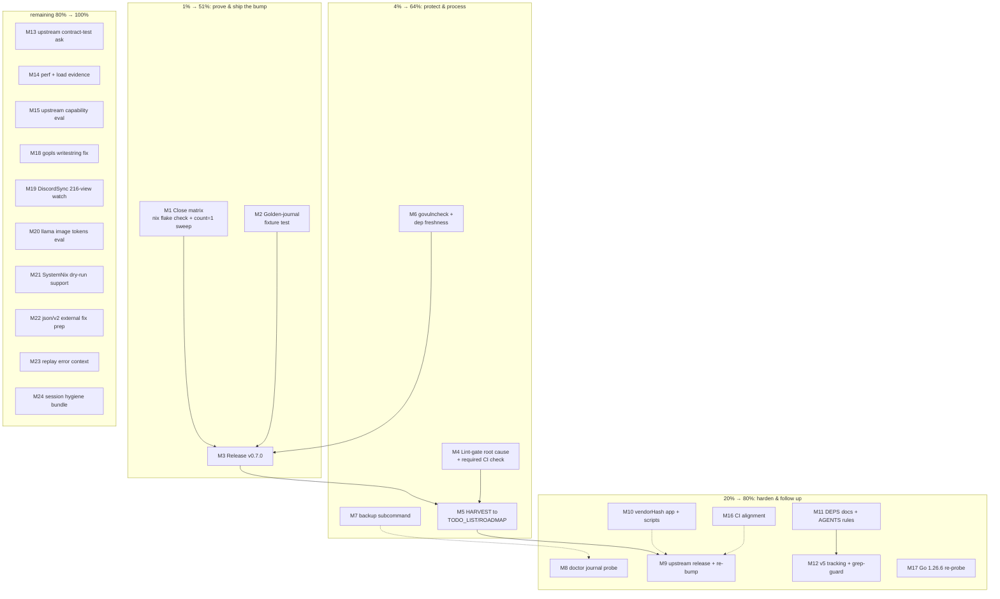

# Pareto Execution Plan — Post-Bump Hardening & Delivery

**Created:** 2026-09-07 17:28 CEST
**Scope:** Everything open in this repo that follows from the 2026-09-07 go-cqrs-lite
full bump session + the living TODO_LIST.md. PLANNING ONLY — zero code changed by
this document.
**Inputs:** `TODO_LIST.md` (5 open items), status report
`docs/status/2026-09-07_17-21_go-cqrs-lite-full-bump-status.md` (50 session items),
session findings. ROADMAP.md raw ideas are deliberately **not** TODOs (doc contract)
— only referenced as out-of-scope pointers.

---

## Step 1 — Pareto Breakdown

The "result" = the bump is **shipped, provable, and regression-proof**, and the
quality gates that let a red commit land are closed.

### 1% → 51% of the result

Three threads. Tiny slice of total work; more than half the total value:

1. **M2 — Golden-journal fixture test.** Converts the session's biggest
   unproven claim ("old journals load unchanged" — proven by eyeballing a
   struct diff) into a permanent, automated guarantee. User data safety.
2. **M1 — Close the verification matrix** (`nix flake check` + cache-free full
   sweep). The green claim currently rests on 7/8 canonical steps.
3. **M3 — Cut v0.7.0.** The bump ships zero customer value while `version` is
   `0.7.0-dev`. Release = delivery.

### 4% → 64% of the result

Adds the threads that protect the result and turn planning into process:

4. **M4 — Lint-gate root cause + required CI check.** A red-lint commit
   (`2934585`) landed; without a gate it happens again.
5. **M6 — govulncheck + dependency-freshness visibility.** New dep set is
   unscanned; 14 sub-modules drift silently.
6. **M7 — `visionreviewd backup` subcommand.** Journal safety operationalized
   (upstream bbolt backup lifecycle exists since v4.1.0).
7. **M5 — HARVEST into TODO_LIST.md / ROADMAP.md.** The plan is a snapshot;
   the living docs are the source of truth.

### 20% → 80% of the result

Adds operational hardening and the sibling-repo follow-up:

8. **M9** — Release go-cqrs-lite master (5–24 unreleased hardening commits per
   module) and re-bump the consumer.
9. **M8** — `doctor` journal-readability probe (fail fast on format drift).
10. **M17** — Go 1.26.6 toolchain re-probe (5 open stdlib CVEs; blocked on
    nixpkgs, probed 2026-08-18).
11. **M10** — `update-vendor-hash` flake app + persisted verify-bump script.
12. **M11** — Docs: DEPS/wire-contract doc, AGENTS.md baseline-lint rule.
13. **M12** — v5 migration tracking + grep-guard against deprecated APIs.
14. **M16** — CI alignment with the canonical matrix (4 concrete checks).

### The remaining 80% (to 100%)

Everything else the session surfaced, plus the pre-existing TODO_LIST items:
M13 (upstream contract-test ask), M14 (perf/load evidence), M15 (upstream
capability evaluation), M18–M24 (gopls fix, DiscordSync watch, llama token
budget, SystemNix dry-run, json/v2 external fix prep, replay error context,
session hygiene), and pointers into ROADMAP.md raw ideas (retention/GC, A2UI
v1.0, failover, EXIF stripping — out of scope here by doc contract).

**Pareto execution order: 1% → 4% → 20% → rest.**

---

## Execution Graph

Release gate (M3) is deliberately last in the 1% tier: M1 and M2 are its
preconditions — don't ship a release whose matrix and data-safety claims are
still open.

---

## Step 2 — Comprehensive Plan (medium granularity, 30–100 min each)

All 55 raw inputs (50 session items + 5 TODO_LIST items) are mapped. Sorted by
impact / effort / customer value. Skills to load per task noted where mandatory.

| ID  | Task (30–100 min)                                                                                                                                                    | Tier | Impact   | Effort | Customer value         | Covers status-report #           | Covers TODO_LIST     |
| --- | -------------------------------------------------------------------------------------------------------------------------------------------------------------------- | ---- | -------- | ------ | ---------------------- | -------------------------------- | -------------------- |
| M1  | Close verification matrix: `nix flake check`, `-count=1` full sweep, record 8/8 evidence                                                                             | 1%   | High     | Low    | Med                    | #1, #17                          | —                    |
| M2  | Golden-journal fixture regression test + wire-tag pin test + fuzz seed                                                                                               | 1%   | High     | Med    | **High** (data safety) | #2, #14, #33, #37, #29           | —                    |
| M3  | Release v0.7.0 end-to-end (`go-release` skill: CHANGELOG, matrix, tag, proxy verify, version reset)                                                                  | 1%   | **High** | Med    | **High**               | #6, #18                          | —                    |
| M4  | Lint-gate: root-cause `2934585` red landing, make lint a required check                                                                                              | 4%   | High     | Low    | Med                    | #3                               | —                    |
| M5  | HARVEST (`docs-health`): route plan items to TODO_LIST/ROADMAP, reconcile a2ui-art-dupl split brain, record Q1–Q3                                                    | 4%   | Med      | Low    | Med                    | #5, #20, #26                     | —                    |
| M6  | govulncheck baseline + matrix/CI integration + dep-freshness script/flake app                                                                                        | 4%   | High     | Med    | Med                    | #7, #24, #25                     | —                    |
| M7  | `visionreviewd backup` subcommand on bbolt backup lifecycle, tested + documented                                                                                     | 4%   | Med      | Med    | **High**               | #9                               | —                    |
| M8  | `doctor` journal-readability probe with current lib version                                                                                                          | 20%  | Med      | Low    | Med                    | #10, #45                         | —                    |
| M9  | Release go-cqrs-lite master, re-bump consumer, re-audit wire diffs (`go-release` + `go-ecosystem-upgrade` skills)                                                    | 20%  | High     | High   | Med                    | #4                               | —                    |
| M10 | `update-vendor-hash` flake app + persisted verify-bump script (validated on known case)                                                                              | 20%  | Med      | Low    | Low                    | #12, #13                         | —                    |
| M11 | Docs: DEPS/wire-contract doc, AGENTS.md baseline-lint rule, DOMAIN_LANGUAGE check, schema_version note, verify pass on new claims                                    | 20%  | Med      | Low    | Low                    | #11, #31, #32, #34, #40          | —                    |
| M12 | v5 migration tracking in ROADMAP + grep-guard test against deprecated pair-form APIs                                                                                 | 20%  | Med      | Low    | Med                    | #21, #38, #41                    | —                    |
| M13 | Upstream asks: serializableEvent contract-test issue + per-module CHANGELOG request (`verify-before-filing` skill first)                                             | 20%  | Med      | Low    | Low                    | #22, #23                         | —                    |
| M14 | Perf evidence: pass/replay benchmark + 10k-event journal load test                                                                                                   | 20%  | Med      | Med    | Med                    | #27, #28                         | —                    |
| M15 | Upstream capability evaluation: WithBatchCommit spike, journal_middleware, query/snapshot/metadata APIs                                                              | 20%  | Low      | Med    | Med                    | #15, #30, #39                    | —                    |
| M16 | CI alignment: no-jsonv2 dir list, jsonv2 -race job, tidy/verify jobs, go.sum↔vendorHash consistency job                                                              | 20%  | Med      | Low    | Med                    | #16, #35, #36, #47               | —                    |
| M17 | Go 1.26.6 toolchain re-probe; if nixpkgs ships it: go.mod + flake bump + full matrix (5 stdlib CVEs)                                                                 | 20%  | **High** | Low    | **High** (security)    | —                                | Toolchain bump       |
| M18 | Fix `internal/reviewd/prompts.go:88` WriteString concat (gopls finding)                                                                                              | rest | Low      | Low    | Low                    | #19                              | —                    |
| M19 | DiscordSync 216-view watch: durable config + interval proposal, present for cadence call                                                                             | rest | Med      | Low    | **High**               | —                                | DiscordSync watch    |
| M20 | llama `--image-min-tokens 1024` evaluation on dense screenshots, recommend or decline                                                                                | rest | Med      | Med    | Med                    | —                                | llama tokens         |
| M21 | SystemNix activation dry-run: docs currency check, doctor against template config, handoff checklist                                                                 | rest | Med      | Low    | Med                    | —                                | SystemNix activation |
| M22 | json/v2 external root fix: inspect go-auto-upgrade rule format, draft exclusion, propose upstream                                                                    | rest | Med      | Low    | Med                    | —                                | json/v2 root fix     |
| M23 | Replay error messages name the offending journal path/stream on DecodePayloadAuto failure                                                                            | rest | Low      | Low    | Low                    | #49                              | —                    |
| M24 | Session hygiene bundle: durable artifact location, LSP-restart habit, version-surface audit, commandtest helpers eval, examples re-check note, bump-PR body template | rest | Low      | Med    | Low                    | #8, #42, #43, #44, #46, #48, #50 | —                    |

## Step 3 — Detailed Breakdown (fine granularity, ≤ 12 min each)

Same sort order. 116 subtasks; every medium task is fully covered.

| ID    | Subtask (≤12 min)                                                                                                           | Parent |
| ----- | --------------------------------------------------------------------------------------------------------------------------- | ------ |
| F1.1  | Run `nix flake check`, capture failures if any                                                                              | M1     |
| F1.2  | Fix any module-eval failures found                                                                                          | M1     |
| F1.3  | `go test -count=1 ./...` cache-free full sweep                                                                              | M1     |
| F1.4  | Annotate status report + AGENTS.md: matrix 8/8 with evidence                                                                | M1     |
| F2.1  | Write test helper that seeds a store and dumps raw journal bytes                                                            | M2     |
| F2.2  | Freeze fixture bytes under `internal/reviewd/testdata/` with provenance header                                              | M2     |
| F2.3  | Test: fixture loads via bbolt backend + decider fold yields expected ViewState                                              | M2     |
| F2.4  | Test: event.DecodePayloadAuto on fixture payloads yields expected events                                                    | M2     |
| F2.5  | Reflection-based test pinning `serializableEvent` JSON tags; fail loudly on drift                                           | M2     |
| F2.6  | Seed fuzz corpus (`fuzz_test.go` equivalents) with fixture payloads                                                         | M2     |
| F2.7  | Run suite + `-race` on reviewd                                                                                              | M2     |
| F2.8  | AGENTS.md: replace "verified by inspection" claim with test reference                                                       | M2     |
| F3.1  | Load `go-release` skill; determine version (0.7.0) + verify no `-dev` stragglers                                            | M3     |
| F3.2  | Write CHANGELOG `[Unreleased]` → `0.7.0` entry (bump, migration, compat)                                                    | M3     |
| F3.3  | Flip `version` var to `"0.7.0"` in cmd/vision                                                                               | M3     |
| F3.4  | Run canonical 8-step matrix, record evidence                                                                                | M3     |
| F3.5  | Commit release prep with detailed message                                                                                   | M3     |
| F3.6  | Cut annotated tag `v0.7.0` from HEAD after matrix green                                                                     | M3     |
| F3.7  | Push branch + tag; watch module proxy propagation                                                                           | M3     |
| F3.8  | Fresh-module `go get github.com/.../vision-review-agent@v0.7.0` validation                                                  | M3     |
| F3.9  | Verify pkg.go.dev + GitHub release; reset `version` to `"0.8.0-dev"`                                                        | M3     |
| F4.1  | `gh run list` around 2026-08-16/17 — did CI run on `2934585`?                                                               | M4     |
| F4.2  | Determine merge protection state: was lint required/skipped/absent?                                                         | M4     |
| F4.3  | Make `golangci-lint` a required status check (or add missing workflow)                                                      | M4     |
| F4.4  | Add lint failure annotation on PRs for faster feedback                                                                      | M4     |
| F4.5  | Document root cause in AGENTS.md + commit message                                                                           | M4     |
| F5.1  | Load `docs-health` skill, HARVEST mode                                                                                      | M5     |
| F5.2  | Route 1%/4% actionable items into TODO_LIST.md (bounded, owned)                                                             | M5     |
| F5.3  | Route 20%/rest long-lived items into ROADMAP.md                                                                             | M5     |
| F5.4  | Reconcile split brain: AGENTS.md says a2ui art-dupl scan is "tracked in TODO_LIST" — it is not; either add or fix AGENTS.md | M5     |
| F5.5  | Record answers to open questions Q1–Q3 (journal reality, CI why, release cadence)                                           | M5     |
| F6.1  | Run `govulncheck ./...` on current dep set, save output durably                                                             | M6     |
| F6.2  | Triage findings: stdlib (link to M17) vs module vulnerabilities                                                             | M6     |
| F6.3  | Add govulncheck step to canonical matrix + AGENTS.md                                                                        | M6     |
| F6.4  | Add govulncheck CI job (weekly + on dep changes)                                                                            | M6     |
| F6.5  | Write `scripts/check-deps.sh`: `go list -m -versions` diff vs go.mod                                                        | M6     |
| F6.6  | Wire script as flake app `.#dep-drift`                                                                                      | M6     |
| F6.7  | Document freshness workflow in AGENTS.md build section                                                                      | M6     |
| F7.1  | Design: `visionreviewd backup <dataDir> <out>` using bbolt `Backup` API                                                     | M7     |
| F7.2  | Implement `Store.Backup(ctx, w io.Writer)`                                                                                  | M7     |
| F7.3  | Wire subcommand dispatch + usage text                                                                                       | M7     |
| F7.4  | Unit test: backup restores into a working store                                                                             | M7     |
| F7.5  | E2E spec in fakeserver suite: capture → backup → restore → replay equal                                                     | M7     |
| F7.6  | Docs: when to backup (pre-upgrade), example invocation                                                                      | M7     |
| F7.7  | Full gate: build, lint, race tests                                                                                          | M7     |
| F8.1  | Design doctor probe: open journal, load all streams, fold head, report                                                      | M8     |
| F8.2  | Implement probe with classified failure output                                                                              | M8     |
| F8.3  | Wire into `doctor` command output                                                                                           | M8     |
| F8.4  | Test: healthy journal passes, corrupted fixture fails with clear message                                                    | M8     |
| F8.5  | Update `doctor` docs + example output                                                                                       | M8     |
| F9.1  | In sibling repo: load `go-release` skill, baseline build+test                                                               | M9     |
| F9.2  | Tag all advanced submodules at master (fresh versions, never reuse)                                                         | M9     |
| F9.3  | Verify tags resolve via module proxy in a clean module                                                                      | M9     |
| F9.4  | Consumer: `go get ...@latest` re-bump + tidy                                                                                | M9     |
| F9.5  | Re-audit wire diffs for the new versions (repeat this session's compat method)                                              | M9     |
| F9.6  | Full consumer gate: matrix + race + reviewd specs                                                                           | M9     |
| F9.7  | Update vendorHash.nix via updated (M10) or documented procedure                                                             | M9     |
| F9.8  | Annotate AGENTS.md + status report with the re-bump                                                                         | M9     |
| F10.1 | Write flake app `.#update-vendor-hash` (automates got:/specified: dance)                                                    | M10    |
| F10.2 | Test app end-to-end on a scratch hash change                                                                                | M10    |
| F10.3 | Write `scripts/verify-bump.sh` (build+vet+lint+test+tidy-diff+verify)                                                       | M10    |
| F10.4 | Validate script against the known-good current state                                                                        | M10    |
| F10.5 | Document both in AGENTS.md build section                                                                                    | M10    |
| F11.1 | Write `docs/DEPS.md`: codec/v4→go-codec split, wire contract, bump procedure                                                | M11    |
| F11.2 | AGENTS.md: add "baseline must include lint" rule                                                                            | M11    |
| F11.3 | Check DOMAIN_LANGUAGE.md for new upstream vocabulary worth adopting                                                         | M11    |
| F11.4 | Add schema_version/evolution note to DEPS.md                                                                                | M11    |
| F12.1 | Create ROADMAP entry: go-cqrs-lite v5 migration plan trigger                                                                | M12    |
| F12.2 | Inventory upstream v5 removals (pair-form APIs, CausationID/ActorID/ClientCreatedAt)                                        | M12    |
| F12.3 | Test: grep-guard that no `repo.Load(`/`repo.Execute(` pair-form calls exist                                                 | M12    |
| F12.4 | Run gate; record guard in test organization docs                                                                            | M12    |
| F13.1 | Load `verify-before-filing` skill                                                                                           | M13    |
| F13.2 | Verify upstream genuinely lacks wire-tag contract coverage                                                                  | M13    |
| F13.3 | Draft contract-test issue with repro + proposed test                                                                        | M13    |
| F13.4 | Draft per-module CHANGELOG request issue/discussion                                                                         | M13    |
| F14.1 | Add benchmark harness for Pass + Replay on seeded store                                                                     | M14    |
| F14.2 | Capture current numbers as baseline doc                                                                                     | M14    |
| F14.3 | Generate 10k-event journal fixture generator (test helper)                                                                  | M14    |
| F14.4 | Run load test: full pass + replay, record timings                                                                           | M14    |
| F14.5 | Compare pre/post-bump characteristics; investigate regressions                                                              | M14    |
| F14.6 | Record results in docs/status follow-up                                                                                     | M14    |
| F15.1 | Spike: enable WithBatchCommit on a test backend, measure write throughput                                                   | M15    |
| F15.2 | Write adopt-or-decline decision note (ADR-style, in DEPS.md)                                                                | M15    |
| F15.3 | Audit event/v4.9 journal_middleware: what hooks exist, do we want them?                                                     | M15    |
| F15.4 | Review query v4.7 / snapshot v4.4 / metadata v4.6 new APIs for daemon fit                                                   | M15    |
| F15.5 | Record outcomes in ROADMAP/TODO_LIST as appropriate                                                                         | M15    |
| F16.1 | Verify CI no-jsonv2 job excludes exactly reviewd + cmd/visionreviewd                                                        | M16    |
| F16.2 | Confirm/add full-module jsonv2 `-race` CI job                                                                               | M16    |
| F16.3 | Confirm `go mod tidy -diff` + `go mod verify` run in CI                                                                     | M16    |
| F16.4 | Add go.sum↔vendorHash consistency check job (nix build dry-run or hash math)                                                | M16    |
| F16.5 | Run affected workflows locally (act or targeted scripts)                                                                    | M16    |
| F17.1 | Re-probe locked + unstable nixpkgs for go 1.26.6                                                                            | M17    |
| F17.2 | If shipped: `go mod edit -go`, flake update, full matrix + nix builds; else reschedule probe                                | M17    |
| F18.1 | Fix prompts.go:88 string concat per strings.Builder pattern                                                                 | M18    |
| F18.2 | Verify lint/bench clean                                                                                                     | M18    |
| F19.1 | Extend discover/config to fold the 216-view testdata glob into durable config                                               | M19    |
| F19.2 | Estimate full-pass duration; propose interval options                                                                       | M19    |
| F19.3 | Present cadence options to user (user call)                                                                                 | M19    |
| F19.4 | Document chosen cadence in TODO_LIST removal note                                                                           | M19    |
| F20.1 | Restart dev llama-server with `--image-min-tokens 1024`                                                                     | M20    |
| F20.2 | Run a2ui Generate on dense-screenshot corpus, both settings                                                                 | M20    |
| F20.3 | Compare fidelity; analyze delta                                                                                             | M20    |
| F20.4 | Write recommend/decline note in TODO_LIST removal note                                                                      | M20    |
| F21.1 | Verify `docs/visionreviewd-systemnix.md` + activation docs current post-bump                                                | M21    |
| F21.2 | Run `visionreviewd doctor` against template config                                                                          | M21    |
| F21.3 | Update SystemNix lock-pin note if needed                                                                                    | M21    |
| F21.4 | Produce user handoff checklist                                                                                              | M21    |
| F22.1 | Inspect go-auto-upgrade config/rule format                                                                                  | M22    |
| F22.2 | Draft `encoding/json` exclusion change                                                                                      | M22    |
| F22.3 | Propose to user (external repo action) with the 4 breakage dates as evidence                                                | M22    |
| F22.4 | Update TODO_LIST item status note                                                                                           | M22    |
| F23.1 | Wrap DecodePayloadAuto errors in replay paths with stream + journal path                                                    | M23    |
| F23.2 | Update affected tests                                                                                                       | M23    |
| F24.1 | Decide + document durable location for run artifacts (or drop the habit)                                                    | M24    |
| F24.2 | Full version-surface audit per go-ecosystem-upgrade reference                                                               | M24    |
| F24.3 | Evaluate adopting upstream commandtest store_suite for reviewd E2E                                                          | M24    |
| F24.4 | Add note: re-check examples/ under no-jsonv2 after every bump (matrix item)                                                 | M24    |
| F24.5 | Session hygiene note: LSP restart after multi-file migrations                                                               | M24    |
| F24.6 | Dependabot-style bump-PR body template: upstream diff range link                                                            | M24    |

---

## Scope Boundaries (VERSCHLIMMBESSER guardrails)

- **This document changes zero code.** Execution happens task-by-task with its
  own gates afterward.
- M3 (release) is gated on M1 + M2 green. M9 (upstream release) is gated on
  M5 (harvest) so the living docs absorb the plan first.
- ROADMAP.md raw ideas (retention/GC, A2UI v1.0, provider failover, EXIF
  stripping, caching, plugins, …) are intentionally **not** scheduled — per the
  doc contract they are unrefined direction, not TODOs. M5/M12 route new
  long-lived items there properly.
- User-action items (SystemNix sudo activation, json/v2 external fix,
  DiscordSync cadence) are **prepared** here (M19/M21/M22), never executed
  unilaterally.
- Known data-model hazard respected: journals are the source of truth; M2/M7/M8
  all extend safety around them before anything touches write paths (M15 spike
  is read/measure-only).

## Open Questions Blocking Full Execution (from status report §g)

1. **Journal deployment reality** — decides M2 depth, M7 priority, M8 priority.
2. **Why `2934585` landed red** — decides M4 root-cause scope (I can inspect CI
   state; the "why it was allowed to merge" is repo-policy knowledge).
3. **go-cqrs-lite release cadence** — gates M9 entirely (sibling repo owner
   decision).
