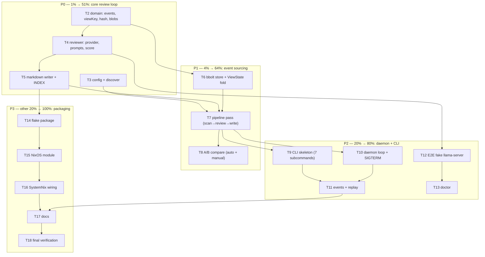

# visionreviewd — Full Execution Plan v2 (Remaining Work)

> **STATUS: FULLY EXECUTED — archived 2026-08-16.** Every task T2–T18
> shipped (see Status column below); final verification passed at `5da8022`.
> Post-build activation work (push, SystemNix bump, host enablement, real-model
> bring-up) is tracked in `TODO_LIST.md`, not here.

**Date:** 2026-08-16 20:00
**Mission:** Turn vision-review-agent into the event-sourced UI review daemon: watch all
projects' UI screenshots, review each view with local llama-server
(`GitMylo/nsfwcaption-qwen3-vl-8b-v3-gguf:Q8_0`), write Crush-consumable markdown reviews,
record everything as go-cqrs-lite events, auto-compare BEFORE→AFTER on changes.

**Already done (this session):** research (DiscordSync/SystemNix/go-cqrs-lite/SDK),
plan v1 (`2026-08-16_19-47-visionreviewd-daemon-plan.html`), T1 bbolt event-store spike
(commit 056ddac), status report 7e8f0a2. This plan covers **T2–T18**.

## Decisions taken (all overridable via config — the 3 open questions, answered by default)

1. **Reviews home:** default `~/.local/share/vision-review-agent/reviews` (daemon state
   dir, NixOS `StateDirectory` synergy). `reviewsDir` is configurable — point it at a
   git-tracked repo (e.g. `~/projects/ui-reviews`) and Crush reads that; the writer does
   not care what kind of directory it is.
2. **llama-server bring-up:** default = daemon only, pointing at an existing base URL.
   The NixOS module ships an **optional** llama-server unit (disabled by default, explicit
   port registered in SystemNix) which auto-pulls the model via `-hf` when enabled.
3. **Model default:** `GitMylo/nsfwcaption-qwen3-vl-8b-v3-gguf:Q8_0` is the config default
   (user-specified). It is caption-tuned, so prompts are engineered descriptive→critical
   with a strict output contract.

## Design addition (from T2 reflection): content-addressed blob store

Screenshot files are overwritten in place (DiscordSync goldens), so the OLD image is gone
by the time we want to A/B compare. Therefore: on every new capture, copy the file to
`<dataDir>/images/<sha256>.<ext>`. Events reference blob paths. This makes A/B compares,
re-reviews, and replay fully self-contained — the event log + blobs ARE the history.

## Event model

| Event           | Payload                                                       | When                                |
| --------------- | ------------------------------------------------------------- | ----------------------------------- |
| `view.captured` | SourcePath, BlobPath, SHA256, CapturedAt                      | scan finds unseen hash              |
| `view.reviewed` | SHA256, Model, Markdown, Score (0–10, −1 unknown), ReviewedAt | model reviewed current capture      |
| `view.compared` | Before/AfterSHA256+BlobPath, Model, Markdown, ComparedAt      | capture changed, predecessor exists |

Stream: `View` type, ID = `<project>:<Page--theme--viewport>`. Reviews layout:
`<reviewsDir>/<project>/views/<Page--theme--viewport>.md`,
`<reviewsDir>/<project>/comparisons/<date>_<view>.md`, `<reviewsDir>/<project>/INDEX.md`.

## Pareto breakdown

- **1% → 51%:** T2–T5 — domain types + reviewer + markdown writer = PNGs in, quality
  markdown out. The entire product value.
- **4% → 64%:** +T6–T8 — event log, dedupe via hashing, blob store, A/B comparisons.
- **20% → 80%:** +T9–T13 — daemon loop, CLI (7 subcommands), replay, E2E fake-server
  confidence, doctor.
- **Other 20% → 100%:** T14–T18 packaging (flake, NixOS module, SystemNix wiring), docs,
  final verification + post-session real-model bring-up & DiscordSync config.

## Medium plan (30–100 min each, 17 tasks, impact-sorted)

| #   | Tier | Task                                                                     | Impact   | Effort | Status                                           |
| --- | ---- | ------------------------------------------------------------------------ | -------- | ------ | ------------------------------------------------ |
| T2  | P0   | Domain: events.go, viewkey.go, hash.go, blobstore.go + tests             | High     | M      | Done `df51b84`                                   |
| T3  | P0   | Config JSON load/validate/defaults + discover walker + tests             | High     | M      | Done `b9d873a`                                   |
| T4  | P0   | Reviewer: openaicompat provider ctor, prompts, score parse + mock tests  | Critical | M      | Done `681915e`, `47a4137`                        |
| T5  | P0   | Markdown writer: view/comparison templates, INDEX, atomic writes + tests | Critical | M      | Done `b24561a`                                   |
| T6  | P1   | Store: bbolt wiring, ViewState fold, Record*/LoadState + tests           | High     | M      | Done `d48c947`, fixed `b0d3bd5`                  |
| T7  | P1   | Pipeline: scan→ingest→compare→review→write + BDD test                    | Critical | L      | Done `f9e77dd`                                   |
| T8  | P1   | Compare flows: auto (changed capture) + manual core + tests              | High     | M      | Done `4e8316d`                                   |
| T9  | P2   | CLI: 7 subcommands, testable parsing, help/exit codes                    | Med      | M      | Done `660e9d3`                                   |
| T10 | P2   | Daemon: ticker loop, SIGTERM graceful stop, single-flight + BDD          | High     | M      | Done `de7c4c6`, lint-cleared `efe9acf`           |
| T11 | P2   | events + replay commands (rebuild reviews from log) + test               | High     | S      | Done `5cddff4`                                   |
| T12 | P2   | E2E: fake OpenAI-compatible httptest server through real provider        | High     | M      | Done `99dcdfe`                                   |
| T13 | P2   | doctor: config, dirs, globs, /v1/models + model-id check                 | Med      | S      | Done `cee0ba7`                                   |
| T14 | P3   | flake.nix visionreviewd package (+ stale vendorHash fix), nix build      | High     | M      | Done `9fd3117`                                   |
| T15 | P3   | NixOS module here: service + optional llama-server unit                  | High     | M      | Done `b2d9c0c`                                   |
| T16 | P3   | SystemNix lazy wrapper module + activation docs                          | High     | S      | Done `4c03af9`, `df7cdf2` (SystemNix `8fc2b80c`) |
| T17 | P3   | Docs: README, CHANGELOG, AGENTS, TODO_LIST, FEATURES                     | Med      | S      | Done `5af6d22`                                   |
| T18 | P3   | Final verify: -race suite, vet, golangci-lint, gofmt                     | High     | S      | Done — all gates green at session close          |

## Fine breakdown (≤12 min each)

> **STATUS: every fine task below shipped with its parent task** — the parent
> Status column above is the verdict; per-row markers omitted to avoid 53
> duplicate annotations of the same 17 commits.

| ID   | Fine task                                                                  | Parent |
| ---- | -------------------------------------------------------------------------- | ------ |
| 2.1  | events.go: payload structs + event type constants                          | T2     |
| 2.2  | viewkey.go: ParseViewKey (`{Page}--{theme}--{viewport}`, fallback) + tests | T2     |
| 2.3  | hash.go: streaming SHA256File + tests                                      | T2     |
| 2.4  | ViewStreamID(project, viewKey) + tests                                     | T2     |
| 2.5  | blobstore.go: CopyToBlobStore (skip if exists) + tests                     | T2     |
| 2.6  | payload JSON roundtrip tests                                               | T2     |
| 2.7  | delete spike_test.go (superseded by T6 store tests)                        | T2     |
| 3.1  | config.go: structs + defaults (model, baseURL, interval 10m, timeout 5m)   | T3     |
| 3.2  | validation with offending values in errors + tests                         | T3     |
| 3.3  | ~ expansion + LoadConfig + tests                                           | T3     |
| 3.4  | discover.go: known-pattern walker → suggested JSON + tests                 | T3     |
| 4.1  | provider.go: ModelProvider.LanguageModel (openaicompat)                    | T4     |
| 4.2  | prompts.go: review + compare templates                                     | T4     |
| 4.3  | reviewer.go: Reviewer.Review via vision.Analyze                            | T4     |
| 4.4  | score.go: `Score: N/10` extraction + tests                                 | T4     |
| 4.5  | mock fantasy.LanguageModel for reviewd tests + Review test                 | T4     |
| 4.6  | Reviewer.Compare core + test                                               | T4     |
| 5.1  | markdown.go: view review render + test                                     | T5     |
| 5.2  | comparison render + test                                                   | T5     |
| 5.3  | INDEX render (score table + trend arrows) + test                           | T5     |
| 5.4  | writer.go: atomic file writes (temp+rename) + test                         | T5     |
| 6.1  | store.go: OpenStore/Close (bbolt backend wiring)                           | T6     |
| 6.2  | ViewState fold for 3 event types + tests                                   | T6     |
| 6.3  | RecordCapture/RecordReview/RecordComparison + tests                        | T6     |
| 6.4  | LoadState + stream listing (journal group) + tests                         | T6     |
| 7.1  | scan.go: globs → Capture{viewKey, path, sha} + tests                       | T7     |
| 7.2  | pipeline.go: Pass orchestration (skip-seen, blob, events, files)           | T7     |
| 7.3  | INDEX refresh per project after pass                                       | T7     |
| 7.4  | BDD: full pass with mock reviewer → events + files asserted                | T7     |
| 8.1  | auto-compare wiring in Pass (before/after blobs) + test                    | T8     |
| 8.2  | manual compare entry (two paths → markdown) + test                         | T8     |
| 9.1  | main.go: subcommand dispatch + flags (no os.Exit in parse)                 | T9     |
| 9.2  | help text + exit codes + main_test.go                                      | T9     |
| 10.1 | daemon.go: Run loop (ticker, ctx cancel)                                   | T10    |
| 10.2 | cmd run: signal.NotifyContext wiring                                       | T10    |
| 10.3 | BDD: ≥1 cycle then clean shutdown                                          | T10    |
| 11.1 | events command (filters, pretty print)                                     | T11    |
| 11.2 | replay command: rebuild reviews dir from log                               | T11    |
| 11.3 | replay test: wipe dir → regenerate → diff                                  | T11    |
| 12.1 | fakeserver_test.go: /v1/chat/completions fixture                           | T12    |
| 12.2 | E2E: provider→reviewer over real HTTP incl. score                          | T12    |
| 13.1 | doctor command (config/dirs/globs/models endpoint)                         | T13    |
| 14.1 | flake.nix: visionreviewd buildGoModule pkg                                 | T14    |
| 14.2 | update stale vendorHash; `nix build .#visionreviewd` verify                | T14    |
| 15.1 | nixos module: services.vision-review-agent options + unit                  | T15    |
| 15.2 | optional llama-server unit (port, hf model, cache dirs)                    | T15    |
| 15.3 | module eval check                                                          | T15    |
| 16.1 | SystemNix lazy wrapper module file                                         | T16    |
| 16.2 | activation docs (input, lock, host enable, port reg)                       | T16    |
| 17.1 | README + CHANGELOG                                                         | T17    |
| 17.2 | AGENTS.md architecture notes; TODO_LIST/FEATURES rows                      | T17    |
| 18.1 | `go test -race ./...` green                                                | T18    |
| 18.2 | vet + golangci-lint + gofmt green                                          | T18    |

## Execution graph

## Verification gates (per task and overall)

- `go build ./...` + targeted `go test` after every task; full `-race` suite at the end.
- BDD proves the story: PNGs in → events recorded → markdown on disk → replay rebuilds.
- Real HTTP path covered by E2E against a fake OpenAI-compatible server.
- `nix build .#visionreviewd` green; NixOS module evals; SystemNix stays checkable (lazy).
- Do not VERSCHLIMMBESSER: no SDK breaking changes, no fmt-only diffs, hooks must pass.
